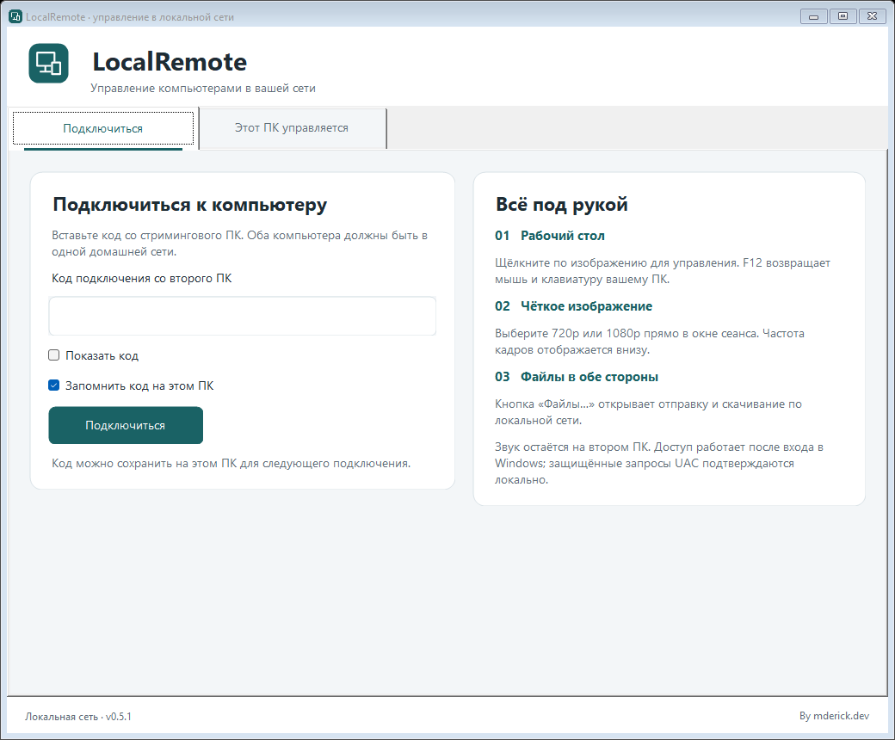

# LocalRemote

Удалённое управление Windows-компьютерами в локальной сети.

**[Скачать готовую сборку для Windows x64](https://github.com/Freddereck/LocalRemote/releases/latest/download/LocalRemote-win-x64.zip)** · [Все релизы](https://github.com/Freddereck/LocalRemote/releases)

Распакуйте ZIP целиком и запустите `LocalRemote.exe`. .NET и FFmpeg входят в комплект.



## Зачем я это сделал

Я устал от отключений AnyDesk каждые 30 минут, нестабильного подключения и соединений с какими-то серверами. Мне нужно управлять своим вторым компьютером, который стоит рядом и подключён к тому же роутеру. Зачем для этого посредник?

Поэтому мы сделали **LocalRemote** — свой софт для подключения напрямую между компьютерами в локальной сети. Основной ПК может быть подключён по Ethernet, второй — по Wi-Fi. Интернет, аккаунт и внешний сервер для работы приложения не нужны.

Обычный RDP меня тоже не устраивал: мне нужен существующий рабочий стол стримингового ПК, чтобы звук продолжал работать там же. LocalRemote не создаёт отдельную RDP-сессию и не перенаправляет звук.

## Что умеет

- Управление мышью и клавиатурой, выбор монитора и полный экран.
- H.264 с профилями **720p / 60 FPS**, **1080p / 60 FPS** и **1080p / 30 FPS**; аппаратное кодирование NVENC или AMD AMF при доступности.
- Менеджер файлов: отправка и скачивание по локальной сети.
- Передача без лимита или с ограничением 4/16/32 МиБ/с; текущая скорость и оставшееся время в окне файлов.
- Автозапуск после входа в Windows, включая режим администратора для повышенных окон.
- Прямое TLS-соединение с проверкой сертификата и ключом доступа.
- Звук, микрофон и выбранные устройства остаются на втором ПК.

60 FPS — целевая частота профиля. Фактическая скорость зависит от компьютеров, Wi-Fi и нагрузки, в том числе OBS. Приложение работает **только в локальной сети**. Доступ до входа в Windows, защищённый экран UAC и Ctrl+Alt+Del не поддерживаются.

## Как запустить

Один и тот же `LocalRemote.exe` используется на обоих компьютерах. Переносите **всю папку сборки**: рядом нужен `ffmpeg.exe`.

На втором ПК включите доступ, разрешите его в брандмауэре и скопируйте код подключения. На основном ПК вставьте код и подключитесь. Передавайте код только тому, кому доверяете доступ к компьютеру.

Подробности установки, автозапуска, обновления и передачи файлов — в [INSTALL.md](INSTALL.md). Результаты проверок — в [VERIFICATION.md](VERIFICATION.md).

## Собрать из исходников

Нужны Windows 10/11 x64 и .NET SDK 10.

```powershell
git clone https://github.com/Freddereck/LocalRemote.git
cd LocalRemote
powershell -NoProfile -ExecutionPolicy Bypass -File scripts\Build.ps1
```

Скрипт скачает FFmpeg с проверкой SHA-256, если его ещё нет, и соберёт автономную версию в `dist\LocalRemote`. На компьютерах, куда переносится готовая сборка, отдельно устанавливать .NET не нужно.

## Исходники и поддержка

Выкладываю проект в общий доступ, потому что хотел решить свою проблему. Можете играть с исходниками как хотите: менять, дорабатывать и делать свои версии.

Поддерживать продукт по запросу я не буду. Сроков исправлений, новых функций и индивидуальной помощи не обещаю. Исходники доступны как есть — если проект пригодится ещё кому-то, отлично.

Код LocalRemote распространяется под [MIT](LICENSE). У FFmpeg и .NET свои лицензии: [THIRD_PARTY.md](THIRD_PARTY.md).

**By mderick.dev**
